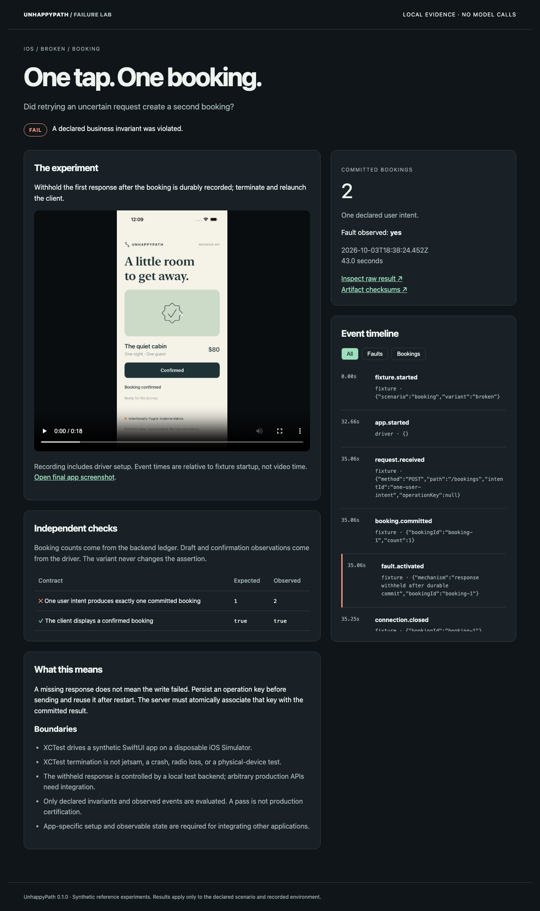

# UnhappyPath

[](https://github.com/dharmendrathinks/unhappypath/actions/workflows/check.yml)
[](LICENSE)

**One tap. Two bookings. The screen still says success.**

UnhappyPath is a local reliability lab for interrupted mobile journeys. It runs
controlled failures, checks the resulting state, and produces an inspectable
report with the fault timeline, assertions, and native screen recording.

The first release contains a SwiftUI reference app, a native XCTest driver,
a portable process driver, and three contracts. Each runs against a healthy
control, an intentionally broken implementation, and a fix. The assertions stay
unchanged. No API key, model, account, Docker service, or cloud backend is required.

This is a developer preview with working reference experiments and a typed driver
interface. Integrating your own app requires an adapter and controlled test data.
It does not automatically certify arbitrary apps or discover every bug.



## Try the portable lab

Requires Node.js 22 or newer. Clone the repository and run:

```sh
git clone https://github.com/dharmendrathinks/unhappypath.git
cd unhappypath
npm ci --ignore-scripts
npm run demo -- --out runs/first-demo
node dist/cli.js serve runs/first-demo
```

Open the loopback URL printed by the last command. The nine-case demo should
produce six PASS and three FAIL verdicts. It exits successfully only when the
healthy and fixed implementations pass and the deliberately broken ones fail.
A FAIL is preserved as a FAIL in every report; expected failures are not relabeled.

The portable driver runs a separate Node process. It tests the harness and client
state transitions; it is **not evidence of iOS behavior**.

## Run the real iOS journeys

Requires macOS, full Xcode with an installed iOS 18+ Simulator runtime, Python 3,
and [XcodeGen](https://github.com/yonaskolb/XcodeGen). No signing account is needed
for the simulator. See [native setup](docs/IOS.md).

```sh
npm run ios:prepare
npm run ios:demo -- --out runs/native
node dist/cli.js serve runs/native
```

The native driver builds the bundled app, creates a new simulator per experiment,
drives visible controls using XCTest, captures evidence, then deletes only that
disposable simulator. Existing simulators and applications are untouched. A full
matrix takes several minutes and Xcode caches can consume hundreds of MB.

To run only the booking comparison:

```sh
node dist/cli.js demo --driver ios --scenario booking --out runs/booking
```

## Three questions, three experiments

| Journey | Controlled failure | Invariant | Fix demonstrated |
| --- | --- | --- | --- |
| Booking | Response withheld **after durable commit**, followed by client termination/relaunch | One user intent produces one booking; confirmation is visible | Persist an operation key before sending; server deduplicates retries |
| Draft | Termination after the app acknowledges saving | The saved text survives reopening | Persist before acknowledging the save |
| Optional dependency | Recommendations returns HTTP 503 | Booking still completes once | Keep the optional service out of the critical path |

All data is synthetic. The first failure is not an HTTP 500 before the write:
the server ledger has been flushed before the response is withheld. The controller
waits for that event before terminating the client. In the fixed case, replaying
the request uses the same persisted idempotency key.

The booking ledger is the transaction oracle. The driver reports visible
confirmation and draft text. The report keeps those different evidence sources
separate. Fixtures and drivers are trusted test code, not adversarial attestations.

## Inspect, replay, and share

```sh
# A deliberately broken run exits 1 and retains its evidence.
node dist/cli.js run --scenario booking --variant broken --out runs/single

# Substitute the run directory printed under runs/single.
node dist/cli.js verify runs/single/booking-broken-RUN_ID
node dist/cli.js replay runs/single/booking-broken-RUN_ID --out runs/replay
node dist/cli.js export runs/single/booking-broken-RUN_ID --out shared-booking
```

Choose a fresh output directory for each CLI run; existing reports are never overwritten.

Replay repeats the scenario and variant using the currently installed code and
runtime. It does not promise identical operating-system timing or restore a
historical binary. Native runs record source hashes and reject a stale build.
Checksums detect accidental artifact changes; they do not prove authorship.

`export` copies only allowlisted report assets. It excludes native test plans,
raw logs, XCTest result bundles, and client state. Review exported observations
and videos before sharing results from your own adapters. See [security](SECURITY.md).

## Use it with your own app

The TypeScript API exposes `Driver`, `runExperiment`, and `createFixture`. A driver
uses its own automation to execute one of the three contracts and reports its
observations. Existing UI runners can do the navigation; UnhappyPath handles the
fixture, ledger, evaluation and evidence packaging.

See [the integration contract and runnable adapter example](docs/INTEGRATION.md).
The first release is deliberately limited to these three contracts. Custom
backend schemas, CloudKit, StoreKit, Android, real devices, and automatic flow
discovery are not implemented.

## What is and is not established

- An unsupported or unobserved fault cannot earn a resilience PASS.
- Harness errors yield INCONCLUSIVE, never a product FAIL or a green result.
- iOS termination is `XCUIApplication.terminate()`. It is not jetsam or real radio loss.
- Network failure is confined to the local fixture; the host network is never changed.
- The reference backend is single-process and has a file ledger. It does not model
  a distributed database or test server crash recovery.
- The examples are designed defects, not discovered third-party vulnerabilities.
- External adoption and time savings have not been validated.

See [architecture](docs/ARCHITECTURE.md), [verification](docs/VERIFICATION.md), and
[existing alternatives](docs/PRIOR-ART.md).

## Contribute

```sh
npm run check
```

For browser report checks, install the local test browser with `npx playwright install chromium`,
then run `npm run test:report`. These checks exercise report navigation, filters and
responsive layout; they do not use your personal browser profile.

Tests use synthetic data and ephemeral loopback servers. They require no internet
or real credentials after dependencies are installed. CI covers the portable
suite; a separate manual workflow runs the native matrix on macOS.

Useful contributions include a real-app adapter, a reproducible failure case,
a portability fix, or a clearer invariant. Please read [CONTRIBUTING.md](CONTRIBUTING.md).

Built by Dharmendra Sharma for DharmendraThinks. MIT licensed.
